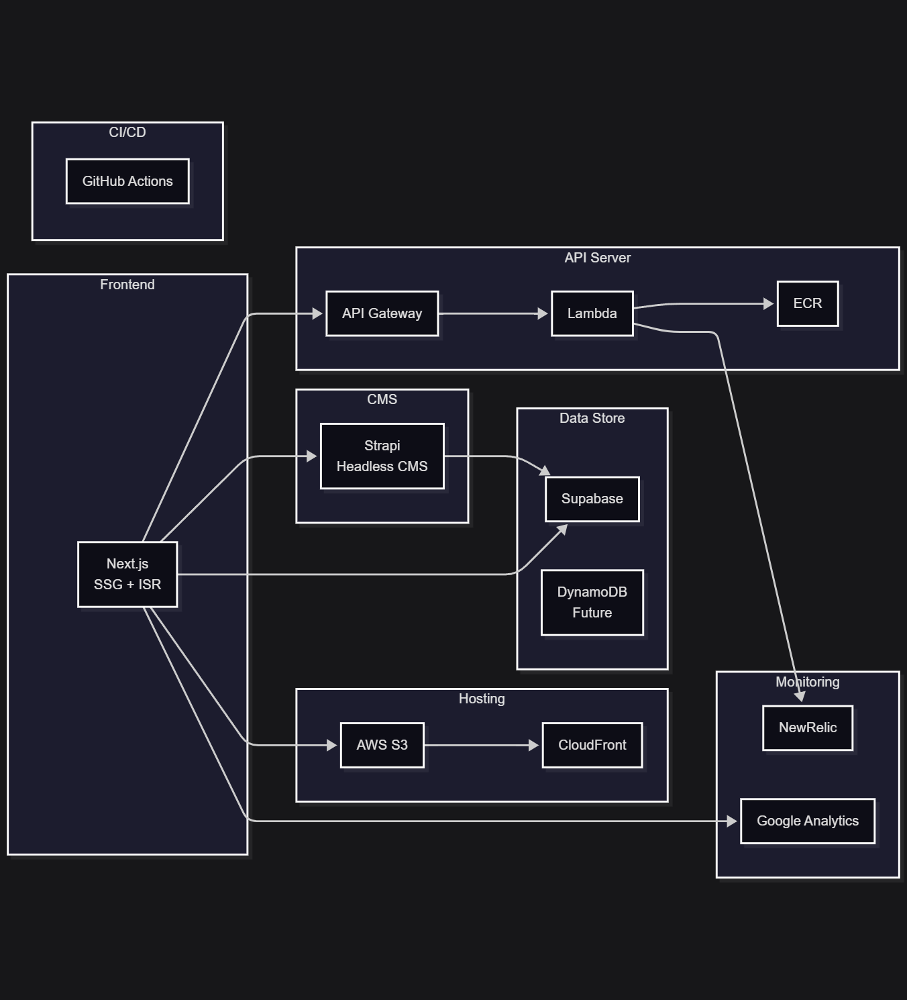

# Documentation

This directory contains project documentation.

## Table of Contents

- [Technology Stack](./tech-stack.md) - Detailed technology stack information
- [Development Rules](../.cursor/rules/dev-rules/globals.mdc) - Development rules and guidelines

## Architecture Overview

## Overview

This project is a blog system built with Next.js. It provides hosting through AWS S3 and CloudFront, data management through Supabase, and CMS functionality through Strapi.

For detailed technical architecture, please refer to [Technology Stack](./tech-stack.md).
