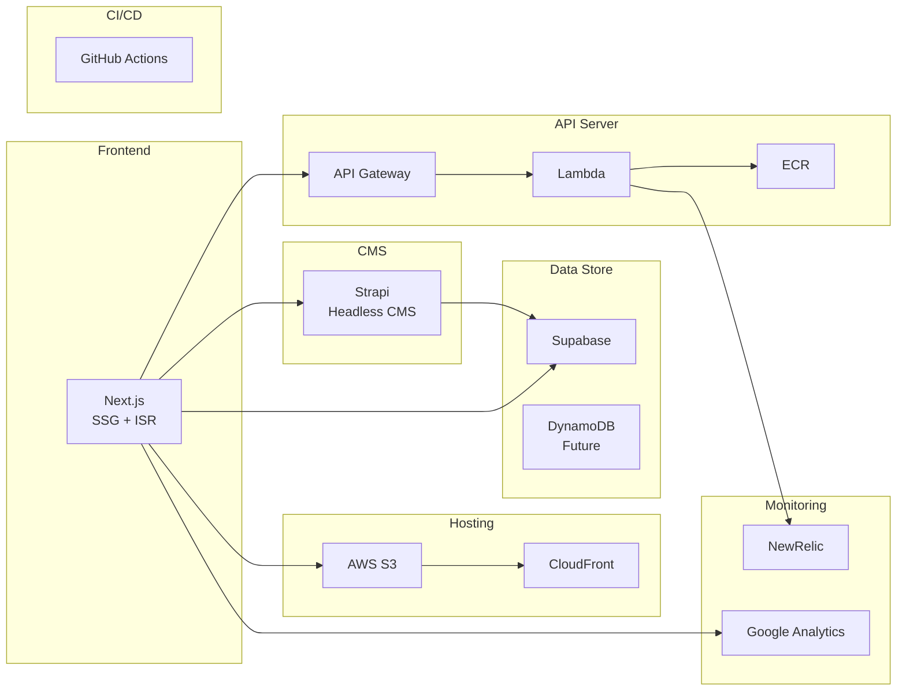

# Technology Stack

## Overview
This document describes the technology stack used in this project.

## Architecture Diagram

## Details

### Hosting Server
- **AWS S3**: Static file hosting
- **AWS CloudFront**: CDN distribution
- **Next.js**: Static generation with SSG + ISR

### Data Store
- **Supabase**: Main database
- **DynamoDB**: Future implementation for scalability improvement

### API Server
- **API Gateway**: API endpoint management
- **Lambda**: Serverless functions
- **ECR**: Container image management

### Headless CMS
- **Strapi**: Content management system

### CI/CD
- **GitHub Actions**: Automated build and deployment

### Monitoring & Analytics
- **NewRelic**: Application monitoring
- **Google Analytics**: User behavior analytics

